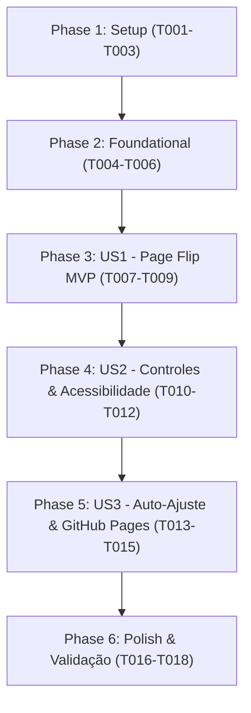

# Tasks: Leitor Interativo do Guia UTI Neonatal (Page Flip)

**Feature**: `001-leitor-guia-pageflip` | **Spec**: [spec.md](file:///home/hiroshi/projetos-pessoais/folheto-carol-melhorado/specs/001-leitor-guia-pageflip/spec.md) | **Plan**: [plan.md](file:///home/hiroshi/projetos-pessoais/folheto-carol-melhorado/specs/001-leitor-guia-pageflip/plan.md)

---

## Phase 1: Setup (Shared Infrastructure)

**Purpose**: Inicialização do projeto, dependências abertas/gratuitas e infraestrutura de build Vite.

- [ ] T001 Inicializar configuração do Vite com React, `page-flip` (licença MIT) e dependências em `package.json` e `vite.config.js`
- [ ] T002 [P] Configurar ponto de entrada HTML com viewport mobile-first e metadados de acolhimento em `index.html`
- [ ] T003 [P] Configurar tokens de design CSS, layout responsivo mobile e tipografia limpa em `src/styles/index.css`

---

## Phase 2: Foundational (Blocking Prerequisites)

**Purpose**: Serviços centrais e fundação de dados necessários para todas as histórias de usuário.

**⚠️ CRITICAL**: Nenhuma história de usuário pode ser finalizada sem a conclusão desta fase.

- [ ] T004 Implementar o serviço dinâmico de carregamento e ordenação de páginas WebP em `src/services/pageService.js`
- [ ] T005 [P] Definir tipos e estruturas de dados do leitor (`PageItem`, `ReaderState`) em `src/types/reader.js`
- [ ] T006 [P] Implementar componente de cabeçalho acolhedor (Header) em `src/components/Header.jsx`

**Checkpoint**: Fundação pronta — os componentes do leitor e histórias de usuário podem ser integrados.

---

## Phase 3: User Story 1 - Folheação Fluida do Guia no Smartphone (Priority: P1) 🎯 MVP

**Goal**: Permitir que mães e familiares visualizem as 33 páginas do guia com animação física realista de virada de folha (*Page Flip*) por toque e arraste no celular.

**Independent Test**: Carregar a aplicação no navegador em modo mobile, tocar/arrastar o canto da página e verificar a virada suave da página 1 até a 33.

### Implementation for User Story 1

- [ ] T007 [US1] Implementar componente de livro interativo integrando `page-flip` com suporte a toque/arraste em `src/components/FlipBook.jsx`
- [ ] T008 [US1] Integrar o carregamento das páginas do `pageService` com o `FlipBook` no componente raiz em `src/App.jsx`
- [ ] T009 [US1] Ajustar estilos e proporções responsivas (*aspect-ratio* vertical) do folheto em `src/styles/flipbook.css`

**Checkpoint**: MVP funcional! A folheação das 33 páginas via Page Flip funciona independentemente no celular.

---

## Phase 4: User Story 2 - Controles Acessíveis e Localização de Leitura (Priority: P2)

**Goal**: Disponibilizar botões de navegação acessíveis ("Anterior" e "Próxima") e contador em tempo real ("Página X de 33") para facilitar a leitura sem depender exclusivamente de gestos.

**Independent Test**: Clicar nos botões "Anterior" e "Próxima" e verificar o avanço/retrocesso de páginas e a atualização correspondente do contador.

### Implementation for User Story 2

- [ ] T010 [P] [US2] Criar barra de controles acessíveis com botões de navegação e indicador de página atual/total em `src/components/Controls.jsx`
- [ ] T011 [US2] Conectar eventos da barra de controles e atalhos de teclado (setas) ao estado do `FlipBook` em `src/App.jsx`
- [ ] T012 [US2] Estilizar barra de controles com áreas de toque acessíveis (mínimo 44px) e estados ativo/desabilitado em `src/styles/controls.css`

**Checkpoint**: Histórias 1 e 2 funcionam de forma integrada e acessível.

---

## Phase 5: User Story 3 - Auto-Ajuste de Páginas e Entrega Estática Leve (Priority: P3)

**Goal**: Garantir carregamento instantâneo via pré-carregamento de imagens adjacentes e empacotamento 100% estático para GitHub Pages.

**Independent Test**: Executar o build de produção (`npm run build`) e validar a abertura do build estático e o pré-carregamento de imagens no console/network.

### Implementation for User Story 3

- [ ] T013 [P] [US3] Implementar pré-carregamento automático em memória das páginas adjacentes (N-1 e N+1) em `src/services/pageService.js`
- [ ] T014 [US3] Configurar script de build e cópia estática das páginas de `docs/paginas` para o diretório de distribuição em `vite.config.js`
- [ ] T015 [US3] Configurar script de deploy para o GitHub Pages em `package.json`

**Checkpoint**: Leitor otimizado com auto-ajuste e pronto para publicação no GitHub Pages.

---

## Phase 6: Polish & Validation

**Purpose**: Refinamentos visuais, feedback de carregamento e validação final contra os critérios de aceitação.

- [ ] T016 [P] Implementar indicador discreto de carregamento (*LoadingIndicator*) em `src/components/LoadingIndicator.jsx`
- [ ] T017 Executar roteiro de validação manual ponta a ponta descrito em `specs/001-leitor-guia-pageflip/quickstart.md`
- [ ] T018 Executar validação de build de produção estático (`npm run build`) e verificação do pacote `dist/`

---

## Dependencies & Execution Order

### Phase Dependencies

### Parallel Opportunities

- **Setup**: `T002` (HTML) e `T003` (CSS) podem ser executados em paralelo após `T001`.
- **Foundational**: `T005` (Types) e `T006` (Header) podem ser executados em paralelo com `T004`.
- **User Story 2**: `T010` (Controls component) pode ser criado em paralelo antes da integração com `App.jsx`.
- **User Story 3**: `T013` (Preload) e `T014` (Vite config) podem ser ajustados em paralelo.

---

## Implementation Strategy

### MVP First (User Story 1)
1. Concluir Setup (Fase 1) e Foundational (Fase 2).
2. Implementar User Story 1 (Fase 3).
3. **Validar MVP**: Testar folheação física das 33 páginas no navegador.
4. Adicionar Controles Acessíveis (User Story 2) e Otimizações de Deploy (User Story 3).
5. Validar build final estático para o GitHub Pages.
